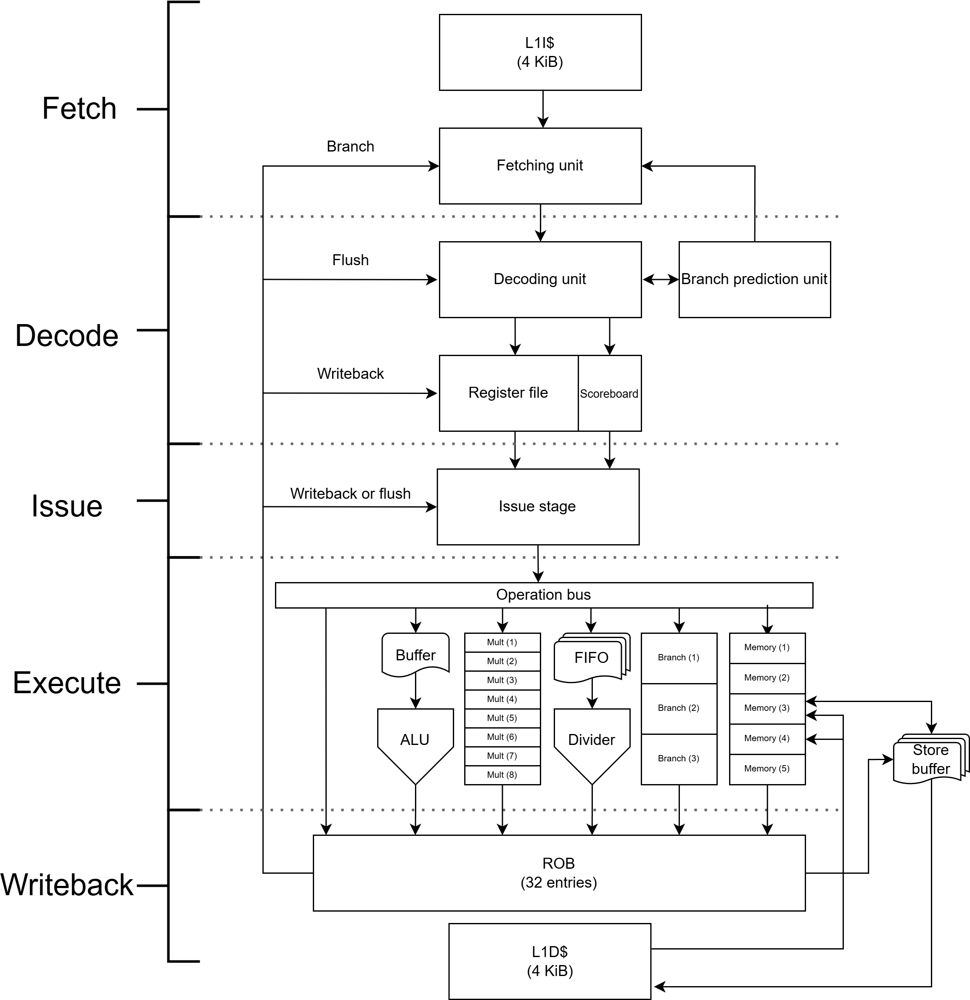

# Slicudis RISC-V III (SRV3) (W.I.P)
This is an open source RV32IMZfencei CPU that features **out of order execution** based on the scoreboarding algorithm. Writebacks are performed in order by the reorder buffer.\
The hardware is written on Systen Verilog (IEEE-1800-2017+).

## Hardware organization
SRV3 features a 5-stage pipeline: Fetch, Decode, Issue, Execute and Writeback.\
\
The modules are organized in the following hierarchy:
```
CPU.sv:
    core.sv:
        fetch_stage.sv
        decode_stage.sv:
                    regfile.sv
                    inst_decoder.sv
                    branch_pred_unit.sv:
                                     btb.sv
                                     saturating_counters.sv
        issue_stage.sv
        execute_stage.sv:
                    alu.sv
                    multiplication_unit.sv
                    branching_unit.sv
                    division_unit.sv
                    memory_unit.sv
        reorder_buffer.sv
    icache.sv
    dcache.sv
```
The following diagram shows the structure of SRV3:



## State of the project

- [ ] core.sv
- [x] fetch_stage.sv
- [ ] decode_stage.sv
- [x] regfile.sv
- [ ] inst_decoder.sv
- [ ] branch_pred_unit.sv
- [ ] btb.sv
- [ ] saturating_counters.sv
- [ ] issue_stage.sv
- [ ] execute_stage.sv
- [x] alu.sv
- [x] multiplication_unit.sv
- [x] branching_unit.sv (will be updated)
- [ ] division_unit.sv
- [ ] memory_unit.sv
- [ ] reorder_buffer.sv
- [ ] icache.sv
- [ ] dcache.sv